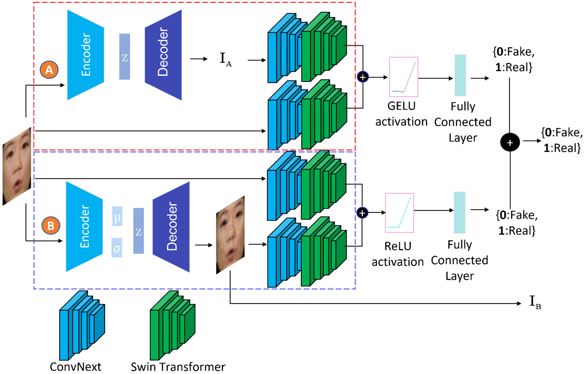

# Deepfake Video Detection Using Generative Convolutional Vision Transformer
Deressa Wodajo, Solomon Atnafu, Zahid Akhtar

This repository contains the implementation code for **Deepfake Video Detection Using Generative Convolutional Vision Transformer (GenConViT)** paper. Find the full paper on arXiv [here](https://arxiv.org/abs/2307.07036).

<br/><br/>

<p align="center">The Proposed GenConViT Deepfake Detection Framework</p>

<p style="text-align: justify;">
Deepfakes have raised significant concerns due to their potential to spread false information and compromise digital media integrity. In this work, we propose a Generative Convolutional Vision Transformer (GenConViT) for deepfake video detection. Our model combines ConvNeXt and Swin Transformer models for feature extraction, and it utilizes Autoencoder and Variational Autoencoder to learn from the latent data distribution. By learning from the visual artifacts and latent data distribution, GenConViT achieves improved performance in detecting a wide range of deepfake videos. The model is trained and evaluated on DFDC, FF++, DeepfakeTIMIT, and Celeb-DF v2 datasets, achieving high classification accuracy, F1 scores, and AUC values. The proposed GenConViT model demonstrates robust performance in deepfake video detection, with an average accuracy of 95.8% and an AUC value of 99.3% across the tested datasets. Our proposed model addresses the challenge of generalizability in deepfake detection by leveraging visual and latent features and providing an effective solution for identifying a wide range of fake videos while preserving media integrity.
</p>

## GenConViT Model Architecture

The GenConViT model consists of two independent networks and incorporates the following modules:
<pre>
    Autoencoder (ed),
    Variational Autoencoder (vae), and
    ConvNeXt-Swin Hybrid layer
</pre>

The code in this repository enables training and testing of the GenConViT model for deepfake detection.

## Table of Contents

- [Requirements](#requirements)
- [Usage](#usage)
  - [Model Training](#model-training)
  - [Model Testing](#model-testing)
- [Results](#results)

## Requirements
<pre>
    * Python 3.x
    * PyTorch
    * numpy
    * torch
    * torchvision
    * tqdm
    * decord
    * dlib
    * opencv
    * face_recognition
    * timm
</pre>

## Usage

1. Clone this repository:

```bash
git clone https://github.com/erprogs/GenConViT
```

2. Install the required dependencies:

```bash
pip install -r requirements.txt
```

## Model Training

To train the GenConViT model, follow these steps:

1. Prepare the training data, or use the sample training data provided:
    * Ensure that the training data is located in the specified directory path.
    * The training data should be organized in the required format. The `fake` directory contains images that are fake, while the `real` directory contains images that are real.
<pre>
    train:
        - fake
        - real
    valid:
        - fake
        - real
    test:
        - fake
        - real
</pre>
 

2. Run the training script:

```bash
python train.py
    -d <training-data-path>
    -m <model-variant>
    -e <num-epochs>
    -p <pretrained-model-file>
    -b <batch-size>
    -t
```

`<training-data-path>`: Path to the training data.<br/>
`<model-variant>`: Specify the model variant (`ed` for Autoencoder or `vae` for Variational Autoencoder).<br/>
`<num-epochs>`: Number of epochs for training.<br/>
`<pretrained-model-file>` (optional): Specify the filename of a pretrained model to continue training.<br/>
`-b` (optional): Batch size for training. Default is 32.<br/>
`-t` (optional): Run the test on the test dataset after training.

The model weights and metrics are saved in the `weight` folder.

**Example usage:** 
```bash
python train.py --d sample_train_data --m vae -e 5 -t y
```
```bash
python train.py --d sample_train_data --m ed --e 5 -t y
```

## Model Testing
**Deepfake Detection using GenConViT**

To make prediction using the trained GenConViT model, follow these steps:

1. Download the pretrained model from [Huggingface](https://huggingface.co/Deressa/GenConViT) and save it in the `weight` folder.

Network A (ed) 
```bash
wget https://huggingface.co/Deressa/GenConViT/resolve/main/genconvit_ed_inference.pth
```
Network B (vae)
```bash
wget https://huggingface.co/Deressa/GenConViT/resolve/main/genconvit_vae_inference.pth
```

**Just to save you from a surprise :)**

The provided weights only include the state dictionary. This means that the size of the provided weights is approximately half of what you would get if you trained the model yourself. 
For example, while the VAE is typically between 5GB and 7GB, the provided one is 2.6GB.


2. Run the prediction script:

To run the code, use the following command:

```bash
python prediction.py \
    --p <path-to-video-data> \
    --f <number-of-frames> \
    --d <dataset> \
    --e <ed-model-weight-name-(without .pth)> \
    --v <vae-model-weight-name-(without .pth)> \
    --fp16 <half-precision>
```
  `<path-to-video-data>`: Path to the video data or `[ dfdc, faceforensics, timit, celeb ]`.<br/>
  `<number-of-frames>`: Specify the number of frames to be extracted for the video prediction. The default is 15 frames.<br/>
  `<model-variant>`: Specify the model variant (`ed` or `vae` or both:genconvit).<br/>
  `<dataset>`: the dataset type. `[ dfdc, faceforensics, timit, celeb ]` or yours.<br/>
  `<half-precision>`: Enable half-precision (float16).

**Example usage:** 
```bash
python prediction.py --p DeepfakeTIMIT --d timit --f 10 
```
To use VAE or ED variant:

VAE:
``` 
python prediction.py --p sample_prediction_data --v --f 10
```

ED:
```
python prediction.py --p sample_prediction_data --e --f 10
```

VAE test on DeepfakeTIMIT dataset:
```
python prediction.py --p DeepfakeTIMIT --v --d timit --f 10
```
run VAE and ED (GENCONVIT): *this runs the provided weights as a defualt*

```
python prediction.py --p sample_prediction_data --e --v --f 10
```

**Testing a new model:**


If you have trained a new model (e.g., if we have `weight/genconvit_vae_May_16_2024_09_34_21.pth`) and want to test it, use the following:

VAE:
```
python prediction.py --p sample_prediction_data --v genconvit_vae_May_16_2024_09_34_21 --f 10
```

ED:
```
python prediction.py --p sample_prediction_data --e genconvit_ed_May_16_2024_10_18_09 --f 10
```

BOTH VAE and ED (GENCONVIT):

```
python prediction.py --p sample_prediction_data --e genconvit_ed_May_16_2024_10_18_09 --v genconvit_vae_May_16_2024_09_34_21 --f 10
```

## Results

The results of the model prediction documented in the paper can be found in the `result` directory. 
```bash
python result_all.py
```

## Bibtex
```bash
@misc{wodajo2023deepfake,
      title={Deepfake Video Detection Using Generative Convolutional Vision Transformer}, 
      author={Deressa Wodajo and Solomon Atnafu and Zahid Akhtar},
      year={2023},
      eprint={2307.07036},
      archivePrefix={arXiv},
      primaryClass={cs.CV}
}
```

## Acknowledgement

This research was funded by Addis Ababa University Research Grant for the Adaptive Problem-Solving Research. Reference number RD/PY-183/2021. Grant number AR/048/2021.
